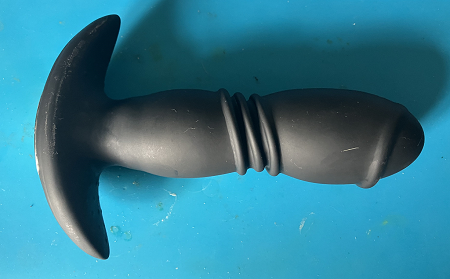
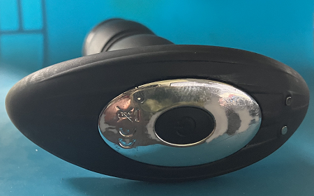

# buttplug-remote
A simple Arduino sketch that randomly transmits the on and off commands for a RF controlled butt plug found on eBay.

The butt plug was supposed to be Bluetooth/App controlled, but the seller sent a model that only works via a remote control. Well that wasn't was desired so I threw together a simple sketch that randomly turns on the toy for 1-3 mins with breaks of 5-30 mins inbetween.

## Which Butt Plug?
Well I don't know its model number, it was just named "Telescopic Thrusting Anal Butt Plug" and the box just says Vibrator and lists features for another product. But I've included two pictures so you can better match the product in question.  
  
  
However, these remote based toys tend to use 433Mhz transmitters and common encoders which tools like [rc-switch](https://github.com/sui77/rc-switch) can easily decode with a cheap 433mhz reciever and your micro of choice.

## LED Indication
The LED flashes red on startup (so you know its working), and lights up green while the toy should be on. Did this so you could power this via a small USB power bank, know that its working, and (for example) throw both in to a time locked box so you can't disable the remote ;-) (I'll leave preventing the user of the toy from removing it or turning the turn itself off as a exercise for the reader...)

## Setting up this project
I use [Platform IO](https://platformio.org/) as my IDE, it's based on VSCode so you can just add it as a extension in VSCode and let it handle downloading the toolchains for your micro. If you use PlatformIO you should just be able to import this project into it and be off to the races, just don't forget to change platformio.ini for your chosen device and serial port.

Or you can just cut & paste the contents of [main.cpp](src/main.cpp) into your IDE of choice (just remember to import the required libraries).

The 433Mhz transmitter is wired on pin 15 and the LED on pin 4 of a ESP32. But any Arduino micro should handle it just fine.

Why did I use an ESP32? Well 1) I have them on hand 2) I might add bluetooth and/or wi-fi support if I can be arsed! But if you just want this simple random on/off sketch then pretty much any Arduino compatible should work, just adjust platformio.ini for your board and adjust the pin defines in [main.cpp](src/main.cpp).

## Libraries  
[rc-switch](https://github.com/sui77/rc-switch) Used to handle the RF transmission.  
[FastLED](https://github.com/FastLED/FastLED) Used to control a "addressable" RGB LED I had on hand to give some visual confirmation of the state the program. I only used a "addressable" RGB LED as that was the first LED I came across when throwing this thing together, any old led(s) could be used and remove the need for FastLED.

If you use PlatformIO these libs should automatically be downloaded when you first compile them, for other IDEs you will prob have to manually download them though the Arduino does have a built in library manager which can be used to download them.

## So what about the Bluetooth version?
The toy was purchased for me by a client who had the Bluetooth version and wanted to know if I could make the app better but the seller sent the wrong version, so I never actually got my hands on a working Bluetooth version (And I wasn't so inclined to "handle" my clients used toy :-P). However after decompiling the app binary for the toy the client did have (all done before the item was shipped) I discovered that its was basically just cloning a lovense toy in terms of communcation so you couuld always try that app if the listed app is a POS, also in the search of a solution for my client I found that people have done most of the work for us anyway. So if you want extra functions for your toy I suggest checking out both [buttplug.io](https://buttplug.io/) and [XToys.app](https://xtoys.app) (which iirc is based on buttplug.io).